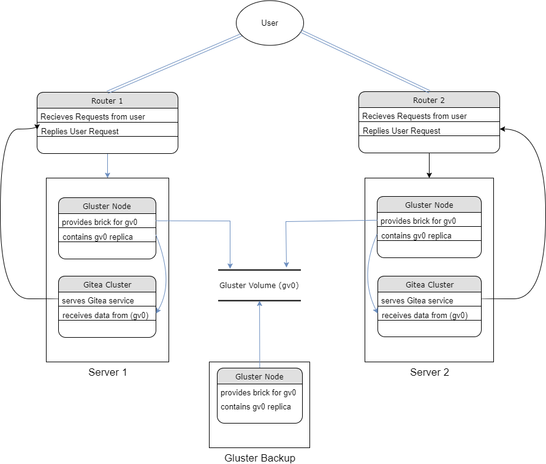

## <u>Dataflow Diagram</u>



## <u>Network Diagram</u>


## Running

* First vagrant up
* Run secondary provisioner
```
vagrant provision --provision-with deploy-gitea
```

* Edit scripts/rescale.sh `SCALE` variable, run rescale provisioner
```
vagrant provision --provision-with rescale
```
to change number of gitea apps in each docker cluster. (Doesn't work yet)
